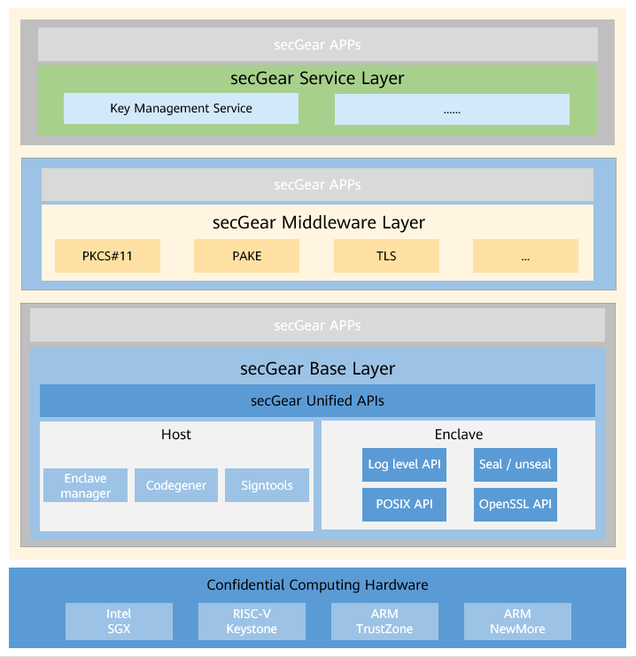

### Overview

With the rapid development of cloud computing, more and more enterprises deploy computing services on the cloud, which makes data protection more complex. In addition, data leakage is a major security problem faced by cloud computing. Therefore, how to ensure the security of user data on the cloud becomes especially important. Currently, data protection focuses on offline storage security and network transmission security, and lacks security protection during data running. To ensure the security of data running on the cloud and facilitate developers to develop cloud applications, openEuler launches secGear.

secGear is a unified confidential computing programming framework that provides easy-to-use development suites, including lifecycle management of secure zones (the system is divided into TEE and REE), secure development library, code generation assistance tool, code building and signing tool, security capability and security service component implementation solution. It can be used in various scenarios, such as trust rings, encrypted databases, multi-party computing, and AI security protection.

This document describes how to use the secGear to guide developers to develop applications based on the secGear to better protect data.

### Architecture

As shown in the preceding figure, the secGear theme consists of three layers (currently, only the base layer is open-source, and the service layer and middleware layer are gradually open-source):

- Service layer: provides complete security services running on the security side.

- Middleware layer: provides a set of protocol APIs to meet basic security application requirements of users.

- Base layer: provides abundant enclave development APIs or tools and supports C POSIX APIs and standard OpenSSL APIs in the security domain. Users can develop secure applications based on these APIs.
