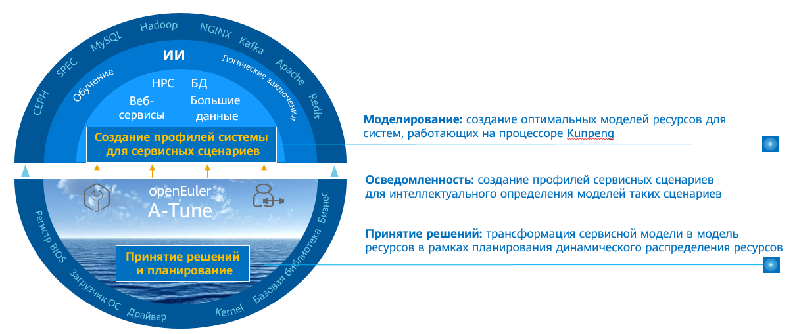
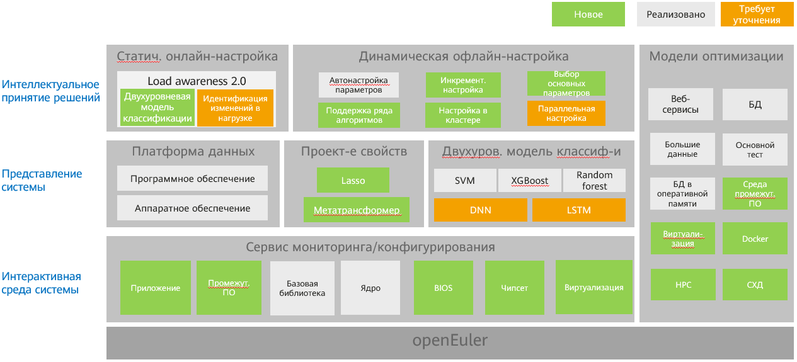

# Ознакомительная информация о приложении A-Tune

- [Ознакомительная информация о приложении A-Tune](#getting-to-know-a-tune)
  - [Введение](#introduction)
  - [Архитектура](#architecture)
  - [Поддерживаемые функции и сервисные модели](#supported-features-and-service-models)

## Введение

Операционная система (ОС) представляет собой базовое программное обеспечение, которое связывает приложения с аппаратными средствами. Поэтому настройка конфигураций ОС и приложений является важным моментом в работе пользователя. От настройки зависит производительность работы служб, оптимальность которой достигается полной загрузкой программных и аппаратных ресурсов. Однако в операционной системе функционируют многочисленные типы рабочих нагрузок и различные приложения, которым требуются разные ресурсы. В настоящее время среда работы приложений, компонуемая из аппаратного и программного обеспечения, включает более 7000 объектов конфигурации. По мере усложнения сервисов и увеличения числа объектов оптимизации временные затраты на оптимизацию растут по экспоненте. В результате резко снижается эффективность данного процесса. Оптимизация становится сложной задачей, создавая пользователям серьезные проблемы.

Кроме того, являясь инфраструктурным программным обеспечением, ОС предоставляет большой набор функций управления программными и аппаратными ресурсами. То, какие функции потребуются, определяет сценарий применения. Поэтому решение о том, какие функции включить, а какие отключить, принимается на основе сценария, а определенной комбинацией функций можно добиться наиболее оптимальной производительности работы приложений.

В реальной среде любого предприятия могут работать сотни и тысячи сценариев, и каждый сценарий требует большого числа аппаратных конфигураций для ресурсов вычисления и хранения, сетевых ресурсов. В лабораторных условиях невозможно предусмотреть все приложения, бизнес-сценарии и комбинации аппаратных средств.

Для решения описанных задач сообщество openEuler разработало приложение A-Tune.

A-Tune — это движок, оптимизирующий производительность системы на основе искусственного интеллекта. С помощью технологий искусственного интеллекта A-Tune точно определяет рабочий сценарий, набор рабочих характеристик и формирует логический вывод, который позволит принять правильное решение, оптимально скомбинировать системные параметры и разработать рекомендации для достижения оптимального состояния работы приложений.

## Архитектура

На следующем рисунке показана основная техническая архитектура A-Tune, состоящая из модуля интеллектуального принятия решений, системного профиля и системы взаимодействия.

- Уровень интеллектуального принятия решений состоит из подсистемы осведомленности, которая выполняет функции интеллектуального анализа и оповещения о состоянии приложений, и подсистемы принятия решений, которая принимает решения по оптимизации работы системы.
- Уровень системного профиля состоит из модуля компоновки функций и двухуровневой модели классификации. Модуль компоновки функций служит для автоматического выбора сервисных функций, а двухуровневая модель классификации используется для обучения и классификации сервисных моделей.
- Уровень системы взаимодействия отслеживает и конфигурирует различные системные ресурсы и выполняет политики оптимизации.

## Поддерживаемые функции и сервисные модели

### Поддерживаемые функции

В [Табл. 1](#table1919220557576) приведены основные функции, поддерживаемые приложением A-Tune, их уровень зрелости и рекомендации по использованию.

**Табл. 1** Перечень функций с уровнями зрелости

| **Функция**                                                  | **Уровень зрелости** | **Рекомендации по   использованию** |
| ------------------------------------------------------------ | -------------------- | ----------------------------------- |
| Автоматическая оптимизация 15 приложений в 11 типах рабочих нагрузок | Протестировано       | Пробное  использование              |
| Пользовательский профиль и сервисные модели                  | Протестировано       | Пробное  использование              |
| Автоматическая оптимизация параметров                        | Протестировано       | Пробное  использование              |

### Поддерживаемые сервисные модели

Исходя из характеристик рабочей нагрузки приложений, A-Tune выделяет 11 типов сервисов. Подробная информация о факторах, снижающих производительность каждого типа сервиса, и о приложениях, поддерживаемых A-Tune, приведена в [Табл. 2](#table2819164611311).

**Табл. 2** Поддерживаемые типы рабочих нагрузок и приложения

| **Категория сервиса** | **Тип**                                              | **Узкое место**                                              | **Поддерживаемые   приложения**     |
| --------------------- | ---------------------------------------------------- | ------------------------------------------------------------ | ----------------------------------- |
| default               | Тип по умолчанию                                     | Низкая загрузка ресурсов процессора, памяти, сети и устройств ввода-вывода | --                                  |
| webserver             | Веб-приложение                                       | Узкие места, связанные с процессором и сетью.                | Nginx, Apache Traffic Server        |
| database              | База данных                                          | Узкие места, связанные с процессором, памятью и устройствами ввода-вывода. | Mongodb, Mysql, Postgresql, Mariadb |
| big_data              | Большие данные                                       | Узкие места, связанные с процессором и памятью.              | Hadoop-hdfs, Hadoop-spark           |
| middleware            | Фреймворк межплатформенного программного обеспечения | Узкие места, связанные с процессором и сетью.                | Dubbo                               |
| in-memory_database    | База данных памяти                                   | Узкие места, связанные с памятью и устройствами ввода-вывода. | Redis                               |
| basic-test-suite      | Базовый набор тестов                                 | Узкие места, связанные с процессором и памятью.              | SPECCPU2006, SPECjbb2015            |
| hpc                   | Геном человека                                       | Узкие места, связанные с процессором, памятью и устройствами  ввода-вывода. | Gatk4                               |
| storage               | Хранение данных                                      | Узкие места, связанные с сетью и устройствами ввода-вывода.  | Ceph                                |
| virtualization        | Виртуализация                                        | Узкие места, связанные с процессором, памятью и устройствами  ввода-вывода. | Consumer-cloud, Mariadb             |
| docker                | Ответвление СУБД                                     | Узкие места, связанные с процессором, памятью и устройствами  ввода-вывода. | Mariadb                             |

