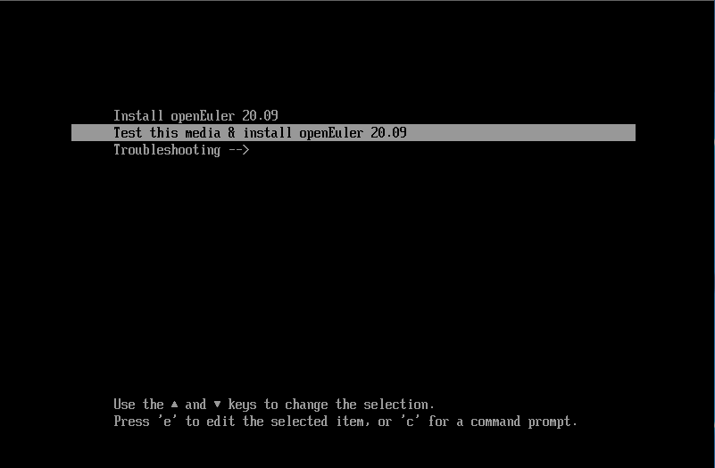
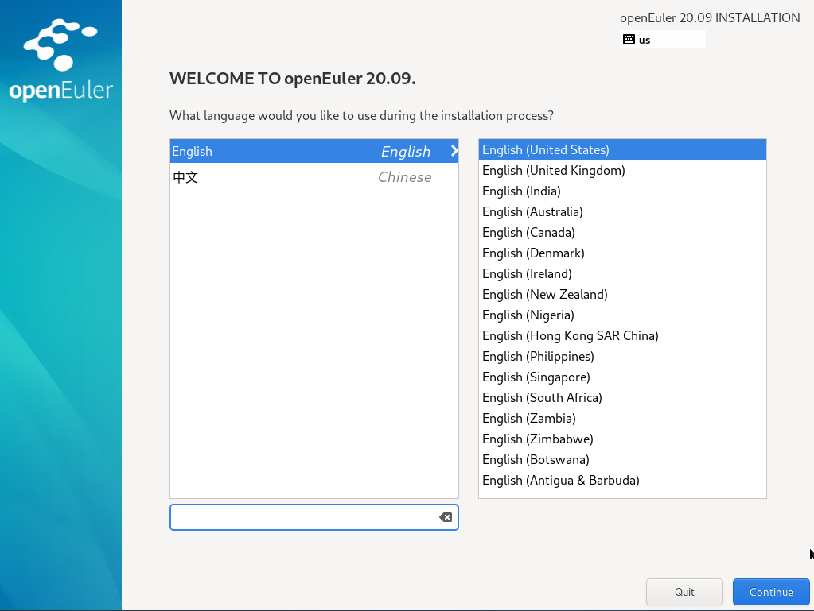
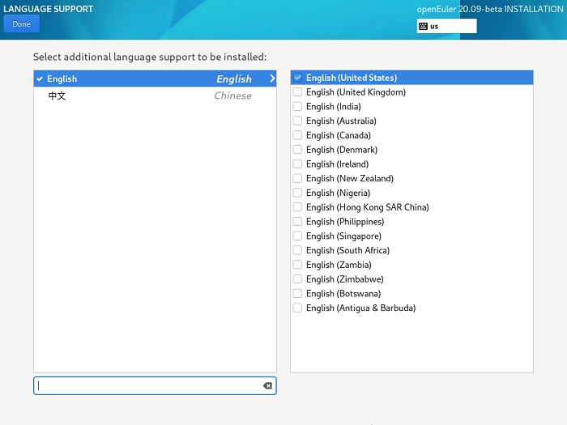
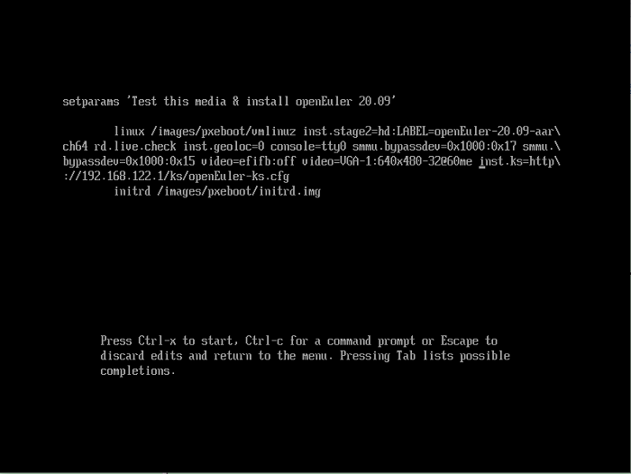
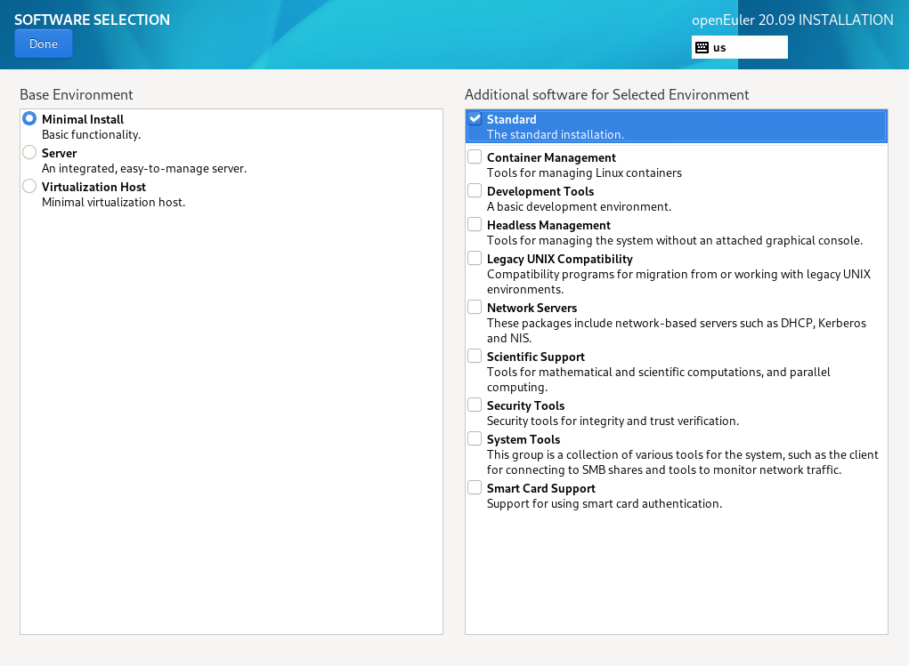
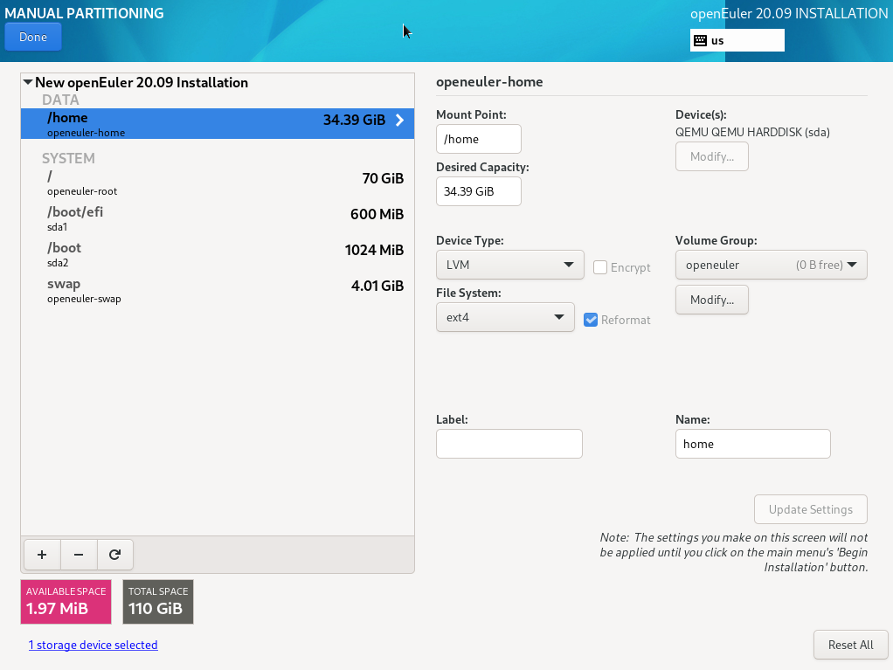
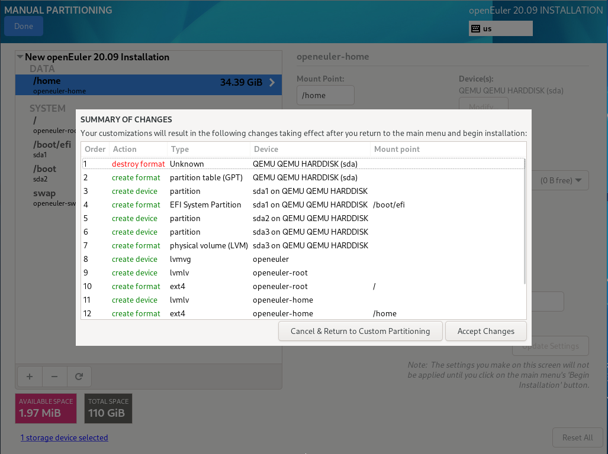
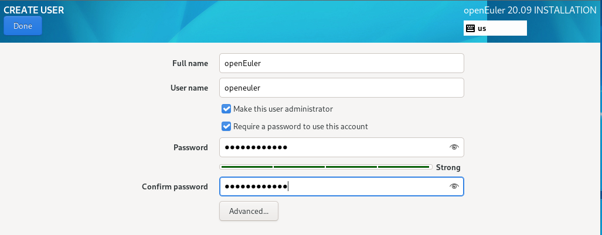

# Инструкции по установке

В этом разделе описывается процедура установки ОС openEuler с помощью CD-ROM. Для всех режимов применяется одна процедура установки, исключение составляет ситуация с выбором параметра загрузки.

\[\[toc]]

## Начало установки

### Загрузка с диска CD/DVD-ROM

Загрузите ISO-образ openEuler с диска CD/DVD-ROM сервера и перезапустите сервер. Процедура выглядит следующим образом:

>  ПРИМЕЧАНИЕ:  
Перед установкой убедитесь, что сервер приоритетно загружается с диска CD/DVD-ROM. Далее приведены шаги установки openEuler с помощью виртуального диска CD/DVD-ROM на контроллер управления базовой платой (Baseboard Management Controller; BMC). Установить openEuler с физического диска не сложно. После выполнения начальных шагов процедура установки с физического диска аналогична процедуре установки с виртуального диска.

1. На панели инструментов щелкните значок (см. следующий рисунок).
   
   **Рис. 1** Значок диска  

   
   На экране появится диалоговое окно с файлами образов, как показано на следующем рисунке.
   
   **Рис. 2** Диалоговое окно с файлами образов  

2. Выберите **Image File** и нажмите **Browse**. На экране появится диалоговое окно **Open**.

3. Выберите файл образа и нажмите **Open**. В диалоговом окне файлов образов нажмите **Connect**. Если **Connect** меняется на **Disconnect**, к серверу подключается виртуальный диск CD/DVD-ROM.

4. Чтобы перезапустить устройство, на панели инструментов щелкните значок (см. следующий рисунок).
   
   **Рис. 3** Значок перезапуска  

### Мастер установки

После загрузки системы с загрузочного устройства появляется меню загрузки. Помимо вариантов запуска программы установки, в меню загрузки есть и другие опции. Во время установки системы по умолчанию используется режим **Test this media \& install openEuler 20.09**. Выберите вариант, нажимая клавиши со стрелками на клавиатуре, и нажмите **Enter**.

>  ПРИМЕЧАНИЕ:
> 
> - Если пользователь не выполняет никаких операций в течение 1 минуты, система автоматически выбирает опцию по умолчанию **Test this media \& install openEuler 20.09** и переключает на страницу установки.
> - Если во время установки PM нельзя выбрать параметры загрузки клавишами со стрелками, и система не отвечает после нажатия клавиши **Enter**, щелкните  на странице BMC и настройте **Key \& Mouse Reset**.

**Рис. 4** Мастер установки  

Описание параметров мастера установки:

- **Install openEuler 20.09**. Установите openEuler на выбранном сервере в режиме графического интерфейса (GUI).

- **Test this media \& install openEuler 20.09**. Это параметр, устанавливаемый по умолчанию. Установите openEuler на выбранном сервере в режиме графического интерфейса (GUI). Целостность установочного устройства проверяется перед запуском программы установки.

- **Troubleshooting**. Это диагностический режим, который используется, когда систему не получается корректно установить. В диагностическом режиме доступны следующие варианты:
  
  - **Install openEuler 20.09 in basic graphics mode**. Это основной графический режим установки. В этом режиме видеодрайвер не запускается, пока не запустится и не начнет работу система.
  - **Rescue the openEuler system**. Это режим, который используется для восстановления системы. В режиме восстановления процесс установки выводится на VNC или BMC, а последовательный порт недоступен.

На экране мастера установки нажмите **e**, чтобы перейти к экрану редактирования выбранного параметра, и нажмите **c**, чтобы перейти к интерфейсу командной строки (CLI).

### Установка в режиме графического интерфейса

На странице мастера установки выберите **Test this media \& install openEuler 20.09**, чтобы войти в режим установки через графический интерфейс.

Выполните графические операции по установке с помощью клавиш на клавиатуре.

- Для перемещения между элементами управления графического интерфейса (такими, как кнопки, поля и флажки) используйте клавишу **Tab** или **Shift+Tab**.
- Для перемещения по списку нажимайте клавиши со стрелками вверх или вниз.
- Для перемещения между горизонтальной панелью инструментов и панелью часов нажимайте клавиши со стрелками влево и вправо.
- Нажмите пробел или **Enter**, чтобы выбрать или удалить выделенные опции, развернуть или свернуть выпадающий список.
- Нажмите **Alt**+ клавишу быстрого вызова (данная клавиша будет разной на разных страницах), чтобы выбрать элемент управления, где находится клавиша быстрого вызова. Клавишу быстрого вызова можно выделить (подчеркнуть), удерживая нажатой клавишу **Alt**.

## Настройка языка программы установки

После запуска установки система предложит язык, который будет использован в процессе установки конфигурации. По умолчанию настроен английский язык, как показано на [Рис. 5](#en-us_topic_0186390093_en-us_topic_0122145864_fig144630179151). Настройте другой язык, если необходимо.

**Рис. 5** Выбор языка  

После настройки нажмите **Continue**. На экране появится главная страница установочных настроек.

Если необходимо выйти из программы установки, нажмите **Exit**. На экране появится сообщение «Are you sure you want to exit the installation program?». Нажмите **Yes** в диалоговом окне, чтобы вернуться на страницу мастера установки.

## Вход на страницу установки

После запуска программы установки на экране появится главная страница установочных настроек, см. [Рис. 6](#en-us_topic_0186390094_en-us_topic_0122145883_fig5969171592212). На странице можно настроить время, язык, источник установки, сеть и устройство хранения данных.

Некоторые элементы настройки отмечены символами безопасности. Символ безопасности исчезнет после того, как элемент будет настроен. Запускайте процесс установки только тогда, когда все символы безопасности исчезнут со страницы.

Если необходимо выйти из программы установки, нажмите **Exit**. На экране появится сообщение «Are you sure you want to exit the installation program?». Нажмите **Yes** в диалоговом окне, чтобы вернуться на страницу мастера установки.

**Рис. 6** Сводка установки  

## Настройка раскладки клавиатуры

На странице **INSTALLATION SUMMARY** нажмите **KEYBOARD**. В систему можно добавлять клавиатуры или удалять их.

- В левом белом поле щелкните, чтобы выбрать раскладку клавиатуры, и нажмите клавиатуру под данным полем.
- Проверка раскладки клавиатуры: в левом белом поле щелкните, чтобы выбрать раскладку клавиатуры, щелкните внутри текстового поля справа и введите текст, чтобы убедиться, что раскладка клавиатуры корректно работает.

**Рис. 7** Настройка раскладки клавиатуры  

Завершив настройку, нажмите **Done** в левом верхнем углу, чтобы вернуться к странице **INSTALLATION SUMMARY**.

## Настройка системного языка

На странице **INSTALLATION SUMMARY** щелкните **LANGUAGE SUPPORT**, чтобы установить системный язык, см. [Рис. 8.](#en-us_topic_0186390098_en-us_topic_0122145772_fig187301927172619) Если необходимо, установите другой язык, например, китайский.

>  ПРИМЕЧАНИЕ:
> 
> - В случае выбора китайского языка (опция **Chinese**) система не поддерживает отображение китайских символов при входе в систему через VNC, но поддерживает их при входе в систему с помощью последовательного порта. Будет система поддерживать отображение китайских символов при входе в систему через SSH или нет, зависит от клиента SSH. Выбор английского языка (опция **English**) не влияет на процесс отображения символов на экране.

**Рис. 8** Настройка системного языка  

Завершив настройку, нажмите **Done** в левом верхнем углу, чтобы вернуться к странице **INSTALLATION SUMMARY**.

## Установка даты и времени

На странице **INSTALLATION SUMMARY** нажмите **TIME \& DATE**. На странице **TIME \& DATE** установите часовой пояс, дату и время системы.

Во время установки часового пояса выберите город, щелкнув его на карте, или выберите регион из выпадающего списка **Region** или город из выпадающего списка **City** в верхней части страницы, см. [Рис. 9](#en-us_topic_0186390096_en-us_topic_0122145900_fig1260162652312).

Если требуемый город не отображается на карте или в выпадающем списке, выберите ближайший город в том же часовом поясе.

>  ПРИМЕЧАНИЕ:
> 
> - Перед ручной настройкой часового пояса отключите функцию синхронизации сетевого времени в правом верхнем углу.
> - Если необходимо использовать сетевое время, убедитесь, что сеть может подключиться к удаленному серверу NTP. Для получения более подробной информации о настройке сети см. раздел [Настройка сети и имени хоста](#setting-the-network-and-host-name).

**Рис. 9** Установка даты и времени 

Завершив настройку, нажмите **Done** в левом верхнем углу, чтобы вернуться к странице **INSTALLATION SUMMARY**.

## Настройка источника установки

На странице **INSTALLATION SUMMARY** нажмите **INSTALLATION SOURCE**, чтобы найти источник установки.

Если для установки используется CD/DVD-ROM, программа установки автоматически обнаружит и отобразит информацию об источнике установки. Можно использовать настройки по умолчанию. На [Рис. 10](#en-us_topic_0186390100_en-us_topic_0144427079_fig93633295132) показан пример.

**Рис. 10** Настройка источника установки  

Если во время установки через сеть сервер HTTPS использует закрытый сертификат, нажмите **e** на странице мастера установки, чтобы перейти на страницу редактирования параметров и добавьте параметр **inst.noverifyssl**, см. [Рис. 11](#fig113517811415).

**Рис. 11** Добавление параметра **inst.noverifyssl**  

Завершив настройку, нажмите **Done** в левом верхнем углу, чтобы вернуться к странице **INSTALLATION SUMMARY**.

>  ПРИМЕЧАНИЕ:  
Вопросы по настройке источника установки, возникающие в ходе установки, см. в разделе [Ошибка при выборе источника установки](./faqs.html#an-exception-occurs-during-the-selection-of-the-installation-source).

## Выбор ПО установки

На странице **INSTALLATION SUMMARY** нажмите **SOFTWARE SELECTION**, чтобы перейти к выбору пакета программного обеспечения, который требуется установить.

В соответствии с фактическими требованиями выберите **Minimal Install** в левом поле и дополнительный компонент в области **Add-Ons for Selected Environment** справа, как показано на [Рис. 12](#en-us_topic_0186390261_en-us_topic_0122145865_fig03031519101414).

**Рис. 12** Выбор установочных пакетов  

>  ПРИМЕЧАНИЕ:
> 
> - В режиме **Minimal Install** устанавливаются не все установочные пакеты. Если требуемый пакет не установлен, можно установить установочные пакеты на локальный ПК, настроить источник репозитория и использовать DNF для установки данного пакета.
> - При выборе режима **Virtual Host** по умолчанию устанавливаются компоненты виртуализации QEMU, libvirt и edk2. Можно отметить необходимость установки компонента OVS в области дополнительных компонентов.

Завершив настройку, нажмите **Done** в левом верхнем углу, чтобы вернуться к странице **INSTALLATION SUMMARY**.

## Настройка пути назначения установки

На странице **INSTALLATION SUMMARY** нажмите **INSTALLATION DESTINATION**, чтобы выбрать диск и раздел установки ОС.

Доступные локальные устройства хранения представлены на [Рис. 13](#fig1195417125015).

>  ПРИМЕЧАНИЕ: 
> Не рекомендуется выбирать устройство хранения NVMe SSD в качестве установочного диска ОС.

**Рис. 13** Настройка пути установки  

### Настройка устройства хранения

На странице **INSTALLATION DESTINATION** настройте устройство хранения для системного раздела. Разделы можно настроить вручную либо выбрать режим **Automatic** для автоматической настройки.

>  ПРИМЕЧАНИЕ:
> 
> - Чтобы обеспечить безопасность и эффективность работы системы, рекомендуется разделить устройство на следующие разделы:  **/boot**, **/var**, **/var/log**, **/var/log/audit**, **/home**, **/tmp**.
> - Если система сконфигурирована с разделом подкачки, этот раздел используется для расширения физической памяти в условиях ее нехватки. Однако это приводит к замедлению отклика системы и ухудшению производительности. Поэтому не рекомендуется настраивать раздел подкачки в системе с достаточным объемом физической памяти или системой, чувствительной к производительности.
> - Если необходимо разделить систему на группу логических томов, выберите режим **Custom** и сделайте настройки вручную. На странице **MANUAL PARTITIONING** щелкните **Modify** в области **Volume Group**, чтобы заново настроить группу логических томов.

**Automatic**

Выберите автоматический режим (**Automatic)**, если программное обеспечение устанавливается на новое устройство хранения или данные в устройстве хранения не требуются. Завершив настройку, нажмите **Done** в левом верхнем углу, чтобы вернуться к странице **INSTALLATION SUMMARY**.

**Customize**

Если необходимо вручную разбить диск на разделы, щелкните **Customize** и нажмите кнопку **Done** в левом верхнем углу. На экране появится следующая страница.

На странице **MANUAL PARTITIONING** диск можно разбить любым из следующих способов. После завершения разбиения на экране появится окно, см. [Рис. 14](#fig1277151815248).

- Автоматическое создание. Щелкните **Click here to create them automatically**. Система автоматически назначает четыре точки монтирования в соответствии с доступным пространством хранения:  **/boot**, **/**, **/boot/efi**, **swap**.

- Создание вручную. Щелкните , чтобы добавить точку монтирования. Рекомендуется, чтобы ожидаемая емкость каждой точки монтирования не превышала доступного пространства.
  
  >  ПРИМЕЧАНИЕ:  
Если ожидаемая емкость точки монтирования превышает доступное пространство, система выделяет под данную задачу оставшееся доступное пространство.

**Рис. 14** Разбиение вручную  

Завершив настройку, нажмите **Done** в левом верхнем углу, чтобы вернуться к странице **SUMMARY OF CHANGES**.

**Рис. 15** Разбиение вручную  

Щелкните **Accept Changes**, чтобы вернуться на страницу **INSTALLATION SUMMARY**.

## Настройка сети и имени хоста

На странице **INSTALLATION SUMMARY** выберите **NETWORK \& HOST NAME** для настройки сетевых функций системы.

Программа установки автоматически обнаруживает локальный интерфейс доступа. Обнаруженный интерфейс появляется в левом поле, а сведения об интерфейсе отображаются в правой области, см. [Рис. 16](#en-us_topic_0186390264_en-us_topic_0122145831_fig123700157297). В правом верхнем углу нажмите на кнопку переключения, чтобы включить или отключить сетевой интерфейс. Настроить выбранный интерфейс можно также, щелкнув **Configure**.

В левом нижнем поле введите имя хоста. Имя хоста может представлять собой полностью определенное имя домена (Fully Qualified Domain Name; FQDN) в формате hostname.domainname или короткое имя хоста в формате hostname.

**Рис. 16** Настройка сети и имени хоста  

Завершив настройку, нажмите **Done** в левом верхнем углу, чтобы вернуться к странице **INSTALLATION SUMMARY**.

## Установка корневого пароля

Выберите **Root Password** на странице **INSTALLATION SUMMARY**. Откроется страница **Root Password**, см. [Рис. 17](#zh-cn_topic_0186390266_zh-cn_topic_0122145909_fig1323165793018). Введите пароль в соответствии с требованиями, приведенными в разделе [Сложность пароля](#密码复杂度), и подтвердите пароль.

>  ПРИМЕЧАНИЕ:
> 
> - Учетная запись **root** используется для выполнения ключевых задач администрирования системы. Не рекомендуется использовать учетную запись **root** для повседневной работы или доступа к системе.
> 
> - Если на странице **Root Password** выбрать пункт **Lock root account**, учетная запись **root** будет отключена.

**Рис. 17** Пароль пользователя **root**  

### Сложность пароля

Пароль пользователя **root** или нового пользователя должен иметь заданную сложность. В противном случае настроить пароль или создать учетную запись не удастся. Требования к сложности пароля следующие:

1. Пароль должен содержать не менее восьми символов.

2. Пароль должен содержать как минимум три типа символов: прописные буквы, строчные буквы, цифры и специальные символы.

3. Пароль должен отличаться от имени учетной записи.

4. Пароль не должен содержать слова, включенные в словарь.
   
   >  ПРИМЕЧАНИЕ:  
В установленной среде openEuler можно экспортировать файл библиотеки словаря **dictionary.txt**, выполнив команду `cracklib-unpacker /usr/share/cracklib/pw_dict > dictionary.txt`, а затем проверить, включен или не включен в данный словарь введенный пароль.

Завершив настройку, нажмите **Done** в левом верхнем углу, чтобы вернуться к странице **INSTALLATION SUMMARY**.

## Создание пользователя

Нажмите **User Creation**. На [Рис. 18](#en-us_topic_0186390266_en-us_topic_0122145909_fig1237715313319) показана страница для создания пользователя. Введите имя пользователя и задайте пароль. Нажатием на кнопку **Advanced** можно также настроить домашний каталог и группу пользователей, как показано на[ Рис. 19](#en-us_topic_0186390266_en-us_topic_0122145909_fig128716531312).

**Рис. 18** Создание пользователя  

**Рис. 19** Дополнительные настройки пользователя 

Завершив настройку, нажмите **Done** в левом верхнем углу, чтобы вернуться к странице с процессом установки.

## Начало установки

После настройки всех обязательных элементов на странице установки символы безопасности исчезают. Далее запускается процесс установки системы нажатием на **Begin Installation**.

**Рис. 20** Начало установки  

## Процедура установки

Как только запустится процесс установки, появится строка общего хода установки и записи пакета программного обеспечения в систему.

>  ПРИМЕЧАНИЕ:  
Если во время установки нажать **Exit** или перезагрузить устройство, или выключить питание сервера, установка прервется, и система будет недоступна. В этом случае необходимо будет заново установить систему.

**Рис. 21** Процесс установки  

## Завершение установки

ОС openEuler установлена, см. [Рис. 22](#en-us_topic_0186390267_en-us_topic_0122145917_fig1429512116338). Нажмите **Reboot**, чтобы перезапустить систему.

**Рис. 22** Завершение установки  

- Если для установки ОС использовался физический диск DVD-ROM, и он автоматически не извлекся во время перезапуска устройства, вручную извлеките диск. Далее на экране появится страница входа в интерфейс командной строки openEuler.
- Если для установки ОС используется виртуальный диск DVD-ROM, измените загрузочное устройство сервера на **Hard Disk** и перезапустите сервер. Далее на экране появится страница входа в интерфейс командной строки openEuler.